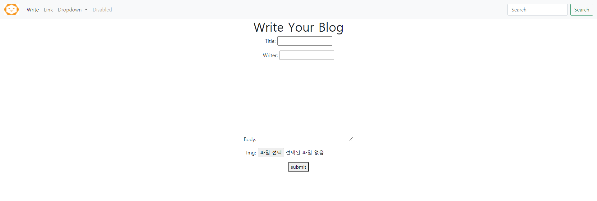

## template inheritance
### nav-bar inheritance
* home.html
   

* new.html
  

## How to use template inheritance
* ### make block
```base.html```


* ### extends base file
```new.html```


## online class


## what is path-converter
* 장고는 MTV 구조임.
* 하나의 페이지를 추가하기 위해서는 html file,view function, DB와 url추가 총 4가지 일이 필요함
* 같은 포멧에 데이터만 달라지는 경우(개인정보 페이지, 상품 상세 페이지)를 전부 다 추가하는 것은 불가능함.
* 이를 해결하기 위해 path-converter라는 기능을 장고에서 제공하고 있음.
